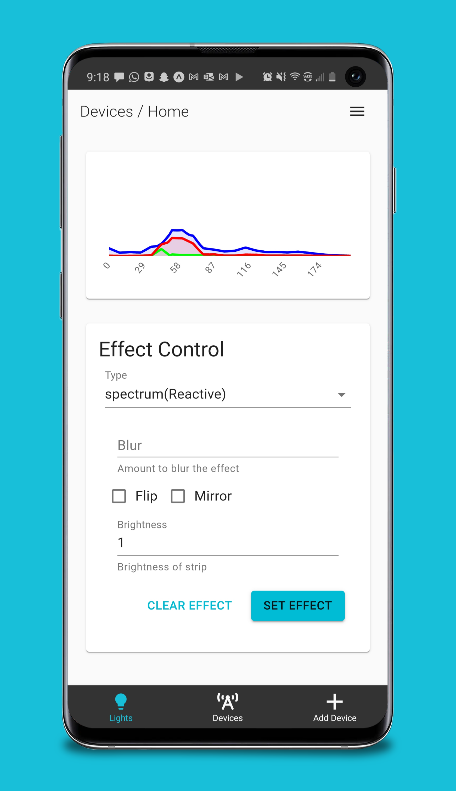
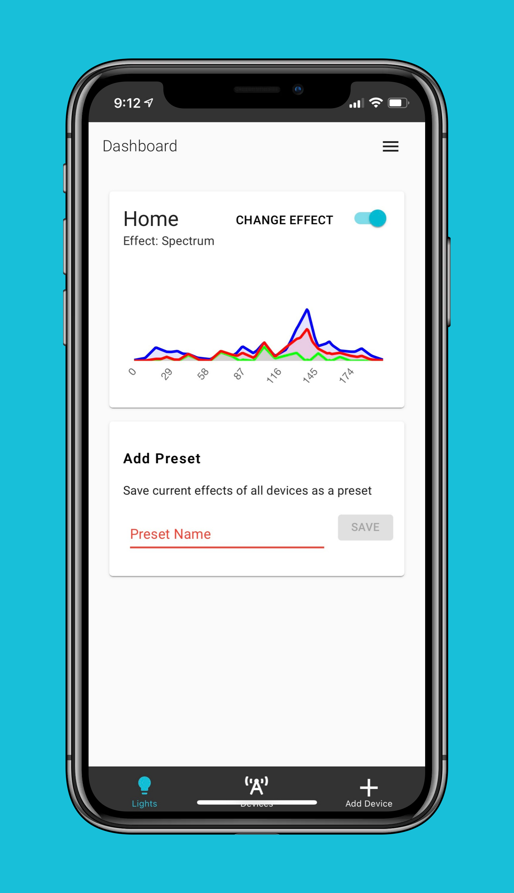
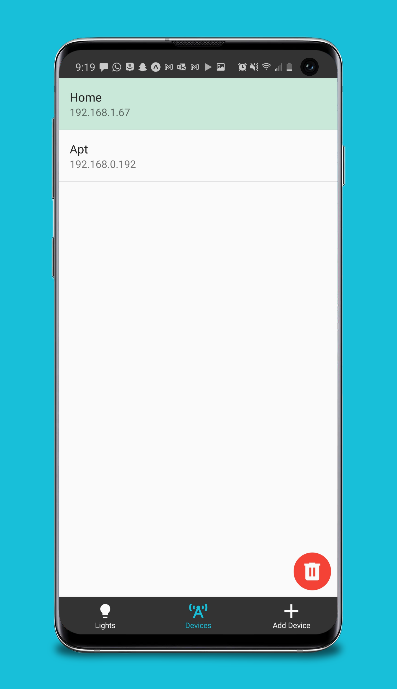
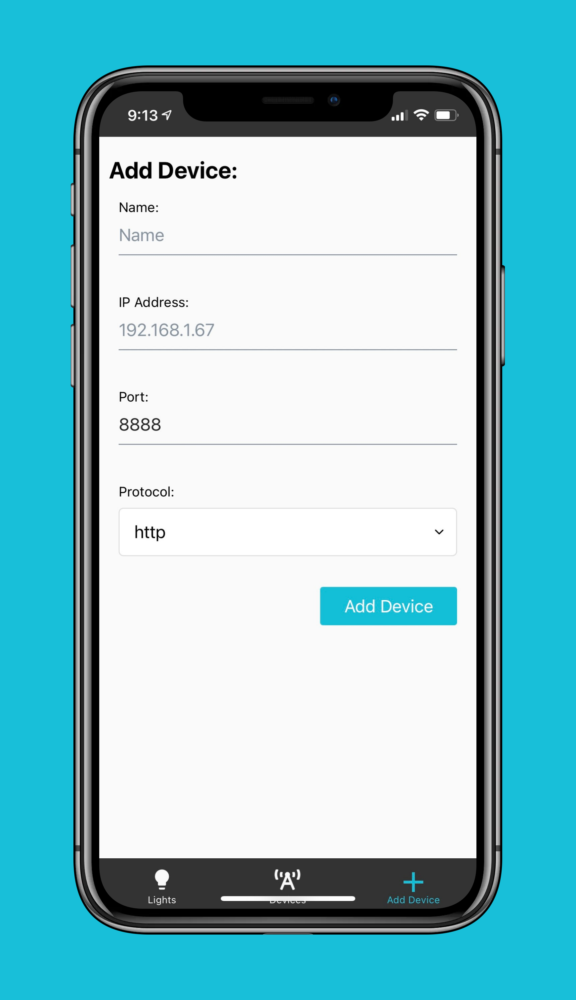
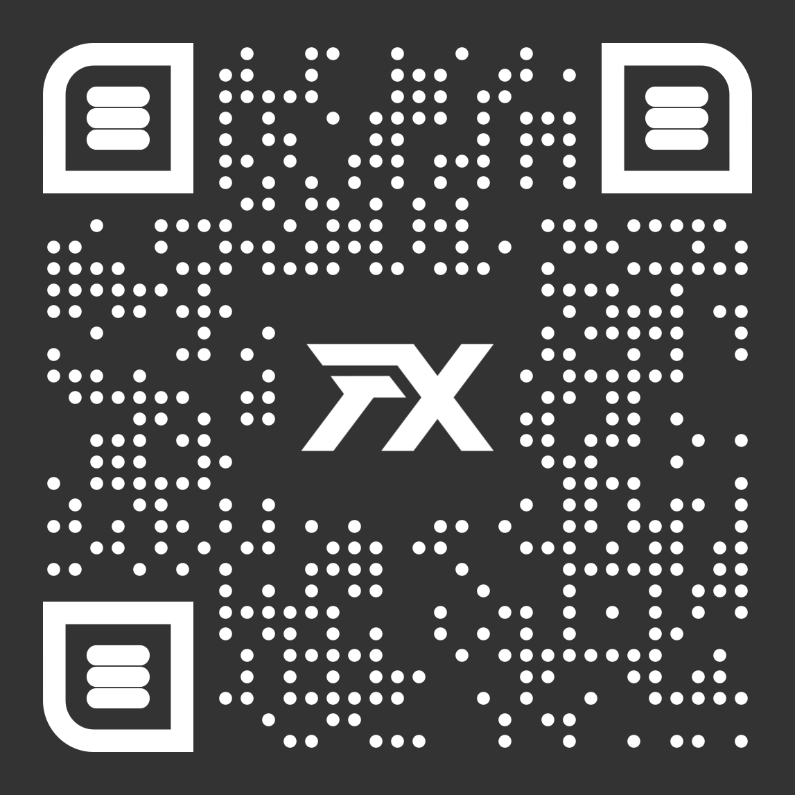

# LedFxMobile

Control your [LedFx](https://github.com/ahodges9/LedFx) sound reactive LEDs from your phone!

## Screenshots

<!--  -->

More screenshots including iPad screenshots are available in `screenshots/`.

## Installation

Just download the Expo app on either the [Play store](https://play.google.com/store/apps/details?id=host.exp.exponent&hl=en_US&gl=US) or the [App store](https://apps.apple.com/us/app/expo-client/id982107779) and scan the QR code below. 

I'm working on getting the app listed on the Play store. I'm not planning to release on the App store because of the $100 yearly fee, unless someone wants to contribute. 

## Todo

- Device discovery (needs backend support)
- Power on/off (needs backend support)
- Brightness controls (needs backend support)
- Speed up devices list rendering
- Redesign Add device screen

## Contributing

This app is built with [React Native](https://reactnative.dev/) using [Expo](https://expo.io/). You'll need to install the [expo-cli](https://docs.expo.io/get-started/installation/) and the [latest version of Node.JS](https://nodejs.org/en/). 

Be sure to use the expo versions of npm commands. For example use `expo install` rather than `npm install` (this one is very important since it could install the wrong versions otherwise). 
